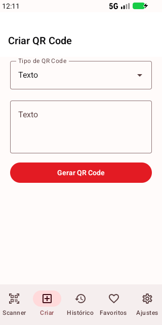
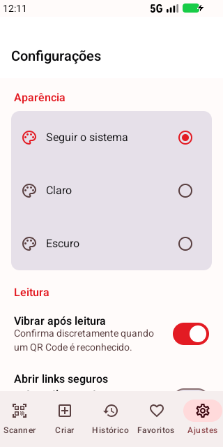
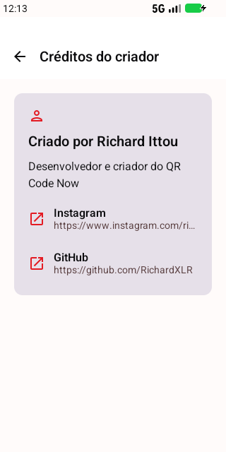

<p align="center">
  
</p>

<h1 align="center">QR Code Now</h1>

<p align="center">
  Leitor, gerador e organizador de QR Codes para Android — rápido, privado e totalmente offline.
</p>

<p align="center">
  <a href="https://github.com/RichardXLR/Qr-Code-Now/actions/workflows/android-ci.yml"></a>
  <a href="https://github.com/RichardXLR/Qr-Code-Now/releases/latest"></a>
  
  
  <a href="LICENSE"></a>
</p>

<p align="center">
  <strong><a href="https://github.com/RichardXLR/Qr-Code-Now/releases/latest">Baixar o APK mais recente</a></strong>
</p>

## Visão geral

O QR Code Now processa câmera, imagens, histórico e códigos inteiramente no aparelho. Não há conta, anúncios, analytics, backend, backup em nuvem ou permissão de internet.

| Criar | Ajustes | Créditos |
|:---:|:---:|:---:|
|  |  |  |

## Recursos

- Scanner offline com CameraX e modelo ML Kit incluído no APK.
- Leitura pela câmera ou pelo Photo Picker, com seleção quando uma imagem contém vários códigos.
- Bloqueio de leituras vazias e repetidas, além de análise local de URLs suspeitas.
- Geração de texto, URL, Wi-Fi, telefone, SMS, e-mail, localização, contato, evento, PIX e conteúdo personalizado.
- Validação automática de leitura antes de salvar um QR Code gerado.
- Histórico local pesquisável, filtros, ordenação, favoritos, seleção múltipla e exclusão com opção de desfazer.
- Temas claro, escuro e automático, com layouts adaptáveis para celulares e telas maiores.
- Ações externas seguras: links, mapas, discador, SMS, e-mail e conexão Wi-Fi sempre passam pela confirmação apropriada do Android.

## Tipos reconhecidos

URL, texto, telefone, SMS, e-mail, Wi-Fi, localização, vCard/contato, evento, PIX/EMV, links de aplicativos e conteúdos desconhecidos.

## Arquitetura

O aplicativo utiliza uma arquitetura em camadas, estado imutável com `StateFlow` e injeção de dependências:

```text
app/
├── data/          # Room, DataStore, scanner e armazenamento de imagens
├── domain/        # Modelos, parser, gerador, contratos e ações seguras
├── presentation/  # Telas Compose e ViewModels
├── navigation/    # Destinos e fluxo de navegação
├── di/            # Módulos Hilt
└── ui/            # Tema e identidade visual

benchmark/         # Macrobenchmark e geração de Baseline Profile
```

Veja os detalhes em [docs/ARCHITECTURE.md](docs/ARCHITECTURE.md).

## Tecnologias

- Kotlin 2.3.21, JDK 21 e bytecode Java 17
- Gradle 9.4.1 e Android Gradle Plugin 9.2.1
- Jetpack Compose, Material 3 e Navigation Compose
- CameraX e ML Kit Barcode Scanning
- Room 3, DataStore, Hilt e Kotlin Coroutines
- ZXing Core para geração e validação de QR Codes
- Baseline Profile e Macrobenchmark

## Como compilar

Requisitos: Android Studio compatível, JDK 21 e Android SDK/API 37. O Gradle Wrapper incluído baixa a versão correta do Gradle.

```bash
gh repo clone RichardXLR/Qr-Code-Now
cd Qr-Code-Now
```

No Windows:

```powershell
.\gradlew.bat testDebugUnitTest lintDebug assembleDebug
```

No Linux ou macOS:

```bash
./gradlew testDebugUnitTest lintDebug assembleDebug
```

O APK de desenvolvimento será criado em `app/build/outputs/apk/debug/app-debug.apk`.

### Build de release

Copie `keystore.properties.example` para `keystore.properties` e preencha apenas na sua máquina:

```properties
RELEASE_STORE_FILE=C:/caminho/seguro/qrcodenow-release.jks
RELEASE_STORE_PASSWORD=sua-senha
RELEASE_KEY_ALIAS=seu-alias
RELEASE_KEY_PASSWORD=sua-senha
```

O arquivo real, os keystores e todos os artefatos assinados estão ignorados pelo Git.

```powershell
.\gradlew.bat assembleRelease bundleRelease
```

Para a Play Store, use o AAB e mantenha a chave de assinatura em armazenamento privado. Consulte [docs/RELEASE_CHECKLIST.md](docs/RELEASE_CHECKLIST.md).

## Privacidade e segurança

- A permissão `CAMERA` é solicitada somente para leitura pela câmera.
- Imagens são selecionadas pelo Photo Picker, sem acesso amplo aos arquivos.
- O histórico fica no banco privado do aplicativo até ser apagado pelo usuário.
- A permissão `INTERNET` é removida explicitamente do manifesto final.
- URLs suspeitas ou esquemas desconhecidos nunca são executados automaticamente.

Leia a [política de privacidade](PRIVACY.md) e a [política de segurança](SECURITY.md).

## Contribuição e licenças

Contribuições são bem-vindas. Consulte [CONTRIBUTING.md](CONTRIBUTING.md) antes de abrir um pull request. Dependências e respectivos termos estão em [THIRD_PARTY_NOTICES.md](THIRD_PARTY_NOTICES.md).

O código deste repositório é distribuído sob a [licença MIT](LICENSE).

## Criador

Criado por **Richard Ittou**.

- [Instagram](https://www.instagram.com/richard.ittou/)
